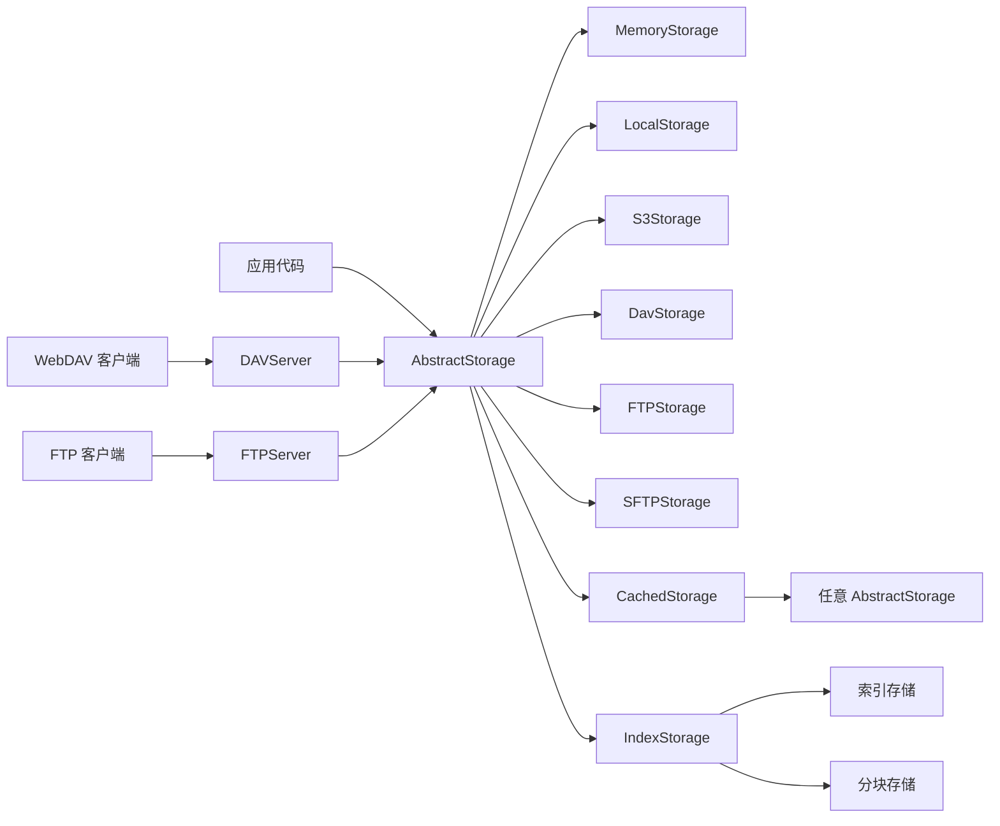

<div align="center">

# Storegate

[](https://www.python.org/)
[](https://github.com/astral-sh/uv)
[](https://github.com/astral-sh/ruff)
[](https://github.com/astral-sh/ty)

[](https://codecov.io/gh/wyf7685/storegate)
[](https://wakatime.com/badge/user/b097681b-c224-44ec-8e04-e1cf71744655/project/a4f8d9e1-526d-4407-8456-cb6c2e1ddec5)


</div>

Storegate 是一个异步、多后端文件存储服务。项目以 `AbstractStorage` 作为统一接口，可直接操作内存、本地文件系统、S3、WebDAV、FTP 和 SFTP，也可以叠加缓存与分块索引层；同一套存储实现还能通过 WebDAV 或 FTP 协议对外提供服务。

> 当前版本：`0.1.0`。项目仍处于开发阶段，接口与配置格式可能调整。

## 主要能力

- 统一的异步文件接口：上传、下载、复制、移动、删除、目录遍历和元数据查询。
- 多种存储后端：Memory、Local、S3-compatible、WebDAV、FTP、SFTP。
- 可组合中间层：
  - `CachedStorage`：缓存元数据、目录列表和小文件下载，支持内存与 Redis 缓存。
  - `IndexStorage`：将大文件切分为内容寻址分块，支持 SHA-256 去重和引用计数。
- 双协议服务端：将任意 `AbstractStorage` 暴露为 WebDAV 或 FTP 服务。
- JSON 对象工厂：通过嵌套配置组合存储和服务，无需在代码中手动组装对象图。
- 异步 I/O：基于 AnyIO、HTTPX（可选 [httpx2](https://github.com/pydantic/httpx2)）、aioftp、AsyncSSH、Uvicorn 和 WsgiDAV。

## 架构概览



项目分为两层：

1. **存储层 `app/storage/`**：定义统一文件系统语义，并实现各存储后端和组合层。
2. **协议层 `app/server/`**：将存储接口适配为 WebDAV 或 FTP 服务。

### 存储后端

| 后端 | 用途 | 关键特性 |
| --- | --- | --- |
| `MemoryStorage` | 测试、临时数据 | 无外部依赖，进程退出后数据丢失 |
| `LocalStorage` | 本地文件系统 | 限制所有路径位于指定根目录内 |
| `S3Storage` | AWS S3 与兼容服务 | SigV4、目录标记、分片上传、并发复制与失败回滚 |
| `DavStorage` | 远程 WebDAV | Basic/Bearer/匿名认证、流式传输、服务端 COPY/MOVE |
| `FTPStorage` | 远程普通 FTP | 连接池、流式传输、逻辑根目录隔离 |
| `SFTPStorage` | 远程 SFTP | SSH host key 校验、多 channel 复用、流式传输与事务式覆盖 |
| `CachedStorage` | 装饰其他后端 | 元数据交叉回填、写后回填、内存/Redis 缓存 |
| `IndexStorage` | 大文件分块与去重 | SHA-256 内容寻址、引用计数、并发上传、文件锁 |

> `LocalStorage` 会在初始化时规范化配置的根目录，并在每次操作中拒绝路径中出现符号链接、连接点或 Windows 重解析点组件，包括操作目标和树操作。此策略旨在防止静态路径配置和意外的链接遍历；它并非通用的操作系统沙箱，也不能防止针对本地并发攻击者的检查到使用（TOCTOU）竞态条件。描述符/句柄相对访问不在此后端的威胁模型范围内。

## 环境要求

- Python `>= 3.14`
- [uv](https://docs.astral.sh/uv/)（推荐的依赖与运行环境管理工具）

安装项目及开发依赖：

```bash
uv sync --group dev
```

S3 / WebDAV 客户端默认使用 `httpx`。若要切换到兼容的 [httpx2](https://github.com/pydantic/httpx2)，安装可选 extra：

```bash
uv sync --group dev --extra httpx2
```

代码统一通过 `from app.utils import httpx` 导入；运行时优先使用已安装的 `httpx2`，否则回退到 `httpx`。CI 可对 `pytest -m httpx` 子集分别在默认依赖与 `uv sync --extra httpx2` 下验证两条路径。

## 快速开始

### 直接使用存储接口

```python
import anyio

from app.storage.memory import MemoryStorage


async def main() -> None:
    async with MemoryStorage() as storage:
        await storage.mkdir("/docs")
        await storage.upload_bytes(b"hello storegate", "/docs/hello.txt")

        info = await storage.stat("/docs/hello.txt")
        content = await storage.download_bytes(info.path)

        print(info)
        print(content.decode())


anyio.run(main)
```

本地文件系统只需替换后端：

```python
from app.storage.local import LocalStorage

storage = LocalStorage("./runtime/files")
```

所有后端都支持异步上下文管理器。网络后端应在 `async with` 中使用，以确保连接被正确建立和关闭。

### 启动 WebDAV 服务

```python
import anyio

from app.server.dav import DAVServer
from app.storage.local import LocalStorage


async def main() -> None:
    server = DAVServer(
        storage=LocalStorage("./runtime/dav"),
        host="127.0.0.1",
        port=8080,
    )
    await server.serve()


anyio.run(main)
```

启动后可使用支持 WebDAV 的文件管理器或客户端访问 `http://127.0.0.1:8080/`。

### 启动 FTP 服务

```python
import anyio

from app.server.ftp import FTPServer
from app.storage.local import LocalStorage


async def main() -> None:
    server = FTPServer(
        storage=LocalStorage("./runtime/ftp"),
        host="127.0.0.1",
        port=2121,
    )
    await server.serve()


anyio.run(main)
```

当前 FTP 服务端支持匿名访问，默认开发端口为 `2121`。

## JSON 配置与对象工厂

Storegate 使用 `$factory` 描述要创建的对象：

- `~name`：解析为 `app.storage.name.Storage`
- `~name:ClassName`：解析为指定存储类
- `@name`：解析为 `app.server.name.Server`
- `@name:ClassName`：解析为指定服务类
- 包含 `$factory` 的嵌套对象会被递归创建

例如，将本地存储包装为缓存存储，再通过 WebDAV 暴露：

```json
{
  "$factory": "@dav",
  "storage": {
    "$factory": "~cached",
    "storage": {
      "$factory": "~local",
      "root": "./runtime/files"
    },
    "ttl": 60,
    "download_cache_threshold": 65536
  },
  "host": "127.0.0.1",
  "port": 8080
}
```

加载配置：

```python
import anyio

from app.server import resolve_server_from_file

server = resolve_server_from_file("server.json")
anyio.run(server.serve)
```

也可使用 `resolve_storage()`、`resolve_storage_from_file()` 和 `resolve_server()` 直接解析字典或 JSON 文件。

## 后端配置

### S3-compatible

```json
{
  "access_key_id": "YOUR_ACCESS_KEY",
  "secret_access_key": "YOUR_SECRET_KEY",
  "region": "us-east-1",
  "bucket": "storegate",
  "endpoint_url": "localhost:9000",
  "path_style": true,
  "scheme": "http"
}
```

```python
from app.storage.s3 import S3Storage

storage = S3Storage("s3.json")
```

省略 `endpoint_url` 时使用 AWS S3；MinIO 等兼容服务通常需要设置 `endpoint_url` 和 `path_style`。

### WebDAV 客户端

```json
{
  "base_url": "https://dav.example.com/remote.php/dav/files/user",
  "auth_mode": "basic",
  "username": "user",
  "password": "password",
  "root_prefix": "/storegate",
  "verify_ssl": true
}
```

`auth_mode` 支持 `basic`、`bearer` 和 `anonymous`。使用自签名证书时可通过 `ca_cert_path` 指定 CA 文件；生产环境不建议关闭 `verify_ssl`。

### FTP 客户端

```json
{
  "host": "ftp.example.com",
  "port": 21,
  "username": "user",
  "password": "password",
  "root_prefix": "/storegate",
  "timeout": 30,
  "max_connections": 2
}
```

当前仅支持普通 FTP，不支持 FTPS/FTPES。

### SFTP 客户端

```json
{
  "$factory": "~sftp",
  "config": {
    "host": "sftp.example.com",
    "port": 22,
    "username": "user",
    "password": "password",
    "known_hosts": "/home/user/.ssh/known_hosts",
    "root_prefix": "/storegate",
    "max_channels": 4
  }
}
```

SFTP 默认执行 SSH host key 校验。测试或受控环境中只有显式设置 `disable_host_key_check=true` 才会关闭校验；生产配置应使用系统或指定的 `known_hosts` 文件。首版支持密码和显式私钥认证，不使用远程 shell、SCP、SSH agent、ProxyJump 或符号链接。

### 分块索引存储

`IndexStorage` 需要两个不同的存储实例：`index` 保存文件元数据，`chunks` 保存去重后的内容分块。

```json
{
  "$factory": "~index",
  "index": {
    "$factory": "~local",
    "root": "./runtime/index"
  },
  "chunks": {
    "$factory": "~local",
    "root": "./runtime/chunks"
  },
  "block_size": 67108864,
  "max_concurrent_uploads": 2
}
```

不要让 `index` 与 `chunks` 指向同一个存储实例。`skip_locking` 会关闭并发写保护，只应在能够确认不存在并发写入时使用。

## 公共存储接口

`AbstractStorage` 的主要方法：

- 生命周期：`connect()`、`close()`、`ping()`
- 上传：`upload_stream()`、`upload_bytes()`、`upload_file()`
- 下载：`download_stream()`、`download_bytes()`、`download_file()`
- 文件操作：`copy()`、`move()`（均支持 `overwrite=True|False`）、`unlink()`、`delete()`、`delete_many()`
- 目录操作：`mkdir()`、`rmdir()`、`rmtree()`、`copytree()`、`movetree()`
- 查询与遍历：`exists()`、`is_file()`、`is_dir()`、`stat()`、`iterdir()`、`list_()`、`walk()`

路径会被统一规范化为 POSIX 风格的绝对逻辑路径。`unlink()` 对不存在文件严格抛出
`FileNotFoundError`（除非 `missing_ok=True`）；`rmdir()` 对不存在路径、文件和非空目录分别抛出
`FileNotFoundError`、`NotADirectoryError` 和 `OSError`。`delete()` 对不存在路径抛出
`FileNotFoundError`；`delete_many()` 按输入顺序 fail-fast，但跳过不存在路径。

`copy()` / `move()` 默认覆盖目标文件，传入 `overwrite=False` 时目标文件冲突抛出
`FileExistsError`，源或目标目录始终抛出 `IsADirectoryError`。同一路径仅在
`overwrite=True` 且源为文件时是无操作；缺少源仍抛出 `FileNotFoundError`。具体异常语义以
`app/storage/abstract.py` 中的接口文档和契约测试为准；远端协议无法分类的错误才保留为 `OSError`。

## 开发与测试

```bash
# 全部测试；外部 S3 配置不可用时建议使用下一条命令
uv run pytest

# 排除需要外部 S3 凭据的测试
uv run pytest -m "not s3"

# 本地 WebDAV / FTP / SFTP 协议集成测试
uv run pytest -m integration

# 仅运行 MemoryStorage 公共契约
uv run pytest tests/contract/storage -k memory

# Lint、格式化与类型检查
uv run ruff check --fix
uv run ruff format
uv run ty check

# 安装预提交钩子
uv run prek install
```

测试以 `tests/contract/storage/` 中的公共契约为核心，同一组行为会针对多个后端参数化执行。DAV、FTP 与 SFTP 集成测试会在本地启动临时协议服务；外部 S3 测试需要单独提供凭据。

## 目录结构

```text
app/
├── storage/
│   ├── abstract.py       # AbstractStorage 与 FileInfo
│   ├── factory.py        # 存储配置解析
│   ├── memory/           # 内存后端
│   ├── local/            # 本地文件系统后端
│   ├── s3/               # S3-compatible 客户端与存储适配
│   ├── dav/              # WebDAV 客户端与存储适配
│   ├── ftp/              # FTP 客户端、连接池与存储适配
│   ├── sftp/             # AsyncSSH SFTP 客户端、channel pool 与存储适配
│   ├── cached/           # 缓存装饰层及缓存后端
│   └── index/            # 分块索引与引用计数
├── server/
│   ├── dav/              # WebDAV 服务端
│   └── ftp/              # FTP 服务端
├── log.py                # Loguru 日志配置
└── utils.py              # 对象工厂、异常翻译等通用工具

tests/
├── contract/storage/     # 多后端公共契约
├── storage/              # 各后端专项测试
├── server/               # 协议服务端测试
├── fixtures/             # 存储与本地协议服务 fixture
└── support/              # 测试辅助工具
```

## 安全说明与当前限制
- S3、WebDAV、FTP 和 SFTP 通过适配层将服务端状态翻译为统一异常；服务端仍可能拒绝不支持的原子操作，此时保留为 `OSError`，不会改变 `overwrite` 或删除契约。
- 当前 WebDAV 服务端允许匿名访问，FTP 服务端同样使用匿名用户；请仅绑定到可信网络或在前置代理/网络层增加认证与访问控制。
- FTP 后端目前不支持加密传输；跨不可信网络应优先使用 WebDAV over HTTPS 或在受保护网络中部署。
- 配置文件可能包含 S3、WebDAV、FTP、SFTP 或 Redis 凭据。不要提交真实密钥；项目已忽略根目录下的 `data/`。
- S3、WebDAV、FTP 和 SFTP 的复制、覆盖及目录删除语义可能受远端服务实现影响。接入新的服务端时应先运行对应契约和集成测试。
- SFTP 的 `root_prefix` 和客户端 symlink 检查不是恶意远端或并发攻击者下的完整沙箱；租户隔离应由服务端 chroot/jail 保证。覆盖式 `movetree` 在 source tombstone 删除开始后无法提供文件系统事务级原子性。
- `IndexStorage` 的索引与分块存储存在绑定关系；迁移或清理任一侧前应先确认引用数据的一致性。
